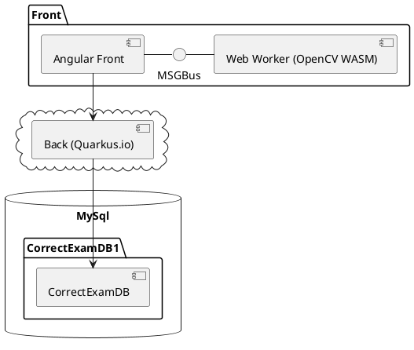
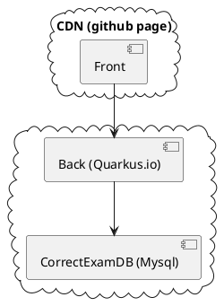

---
# try also 'default' to start simple
theme: seriph
# random image from a curated Unsplash collection by Anthony
# like them? see https://unsplash.com/collections/94734566/slidev
background: https://source.unsplash.com/collection/94734566/1920x1080
# apply any windi css classes to the current slide
class: 'text-center'
# https://sli.dev/custom/highlighters.html
download: true
highlighter: shiki
# show line numbers in code blocks
lineNumbers: false
# some information about the slides, markdown enabled
info: |
  ## Slidev Starter Template
  Presentation slides for developers.

  Learn more at [Sli.dev](https://sli.dev)
# persist drawings in exports and build
drawings:
  persist: false
---

# Correct Exam

Modern software architecture in practise

  
    Press Space for next page <carbon:arrow-right class="inline"/>
  

  <button @click="$slidev.nav.openInEditor()" title="Open in Editor" class="text-xl icon-btn opacity-50 !border-none !hover:text-white">
    <carbon:edit />
  </button>
  <a href="https://olivier.barais.fr/corrigeExamFront/" target="_blank" alt="GitHub"
    class="text-xl icon-btn opacity-50 !border-none !hover:text-white">
    <carbon-logo-github />
  </a>

<!--
The last comment block of each slide will be treated as slide notes. It will be visible and editable in Presenter Mode along with the slide. [Read more in the docs](https://sli.dev/guide/syntax.html#notes)
-->

---

# Highly inspired by GradeScope Solution

> Gradescope grading software allows students to receive faster and more detailed feedback on their work, and allows instructors to see detailed assignment and question analytics. It is an easy way to take submissions digitally in order to preserve the original work and allow for quick and easy viewing from anywhere.

<!--

This is a left-bottom aligned footer

-->

---

# Why building that piece of software ?

- Enable to correct exam during meetings 😀
- Try to initiate a project with Younup to see how we could engage efficiently software engineer available for some days
- Create an open source implementation of real software with complex architecture to have a case study for
  - experiments in software engineering research
  - explaining modern software architecture to students

---

# The technical architecture

- [**Quarkus**](https://quarkus.io/) for the back (Java + native compiltation through GraalVM)
- [**Angular 13.3**](https://angular.io/) for the front
  - [**pdf.js**](https://mozilla.github.io/pdf.js/) to play with pdf (exam, scan exam, feedback for students)
  - [**fabric.js**](http://fabricjs.com/) to draw on top of a pdf
  - [**opencv**](https://opencv.org/) in wasm within a web worker to analyse the scan
  - [**tensorflow JS**](https://www.tensorflow.org/js) with the browser for digit and letter recognition
  - ...
- [**Docker**](https://www.docker.com/) and K8S to deploy the back and the monitoring layer
- Front is hosted in a CDN to follow the [JamStack](https://jamstack.org/) architecture
- CI/CD using [**github action**](https://github.com/features/actions), [**dockerhub webhook**](https://docs.docker.com/docker-hub/webhooks/), and [**gowebhook**](https://github.com/adnanh/webhook)

---

# Architecture overview

---

# Diagrams

You can create diagrams / graphs from textual descriptions, directly in your Markdown.

### Conceptual architecture

### deployed architecture

---

## Business model

---

## JHipster to generate the application skeleton

> JHipster is a development platform to quickly generate, develop, & deploy modern web applications & microservice architectures.

- jhipster 7.7.0 for the front
- jhisper 6.10.15

> Manual alignement of the API evolution 😀 (@Djamel)

---

# Where we are

## Done

- [x] Vue home
- [x] Donnée factice
- [x] Afficher vraie liste de cours (requête au back)
- [x] Masquer vue entité pour user
- [x] Premère page
- [x] Composant Cours viusualisation 
- [x] Composant Insérer groupe étudiant
- [x] Composant supprimer UE
- [x] Voir groupe étudiant pour une UE incluant VIDER LISTE ETUDIANT pour cet UE
- [x] Refactoring module
- [x] Composant Créer exam
- [x] Composant Exam (Supprimer Exam, Lien Editer Zone, Charger scanétudiant, Lancer mapping nom étudiant, Corriger)

---

## Done

- [x] Composant ExamEditerzone
  - [x] Créer type de rectangle fabric
- [x] Vérifier compilation native
- [x] Vue question
- [x] Mise en place CI
- [x] Mise en place CD (front)
- [x] Vue home admin
- [x] Bouton retour dans la partie annoter document
- [x] Bouton charger scan
- [x] Bouton associé copies
- [x] Bouton Corriger
- [x] Intégration opencv
- [x] Test intégration opencv
- [x] Mise en place CD (back)
- [x] Alignement pdf (opencv)

---

## Ongoing

- [ ] Backup alignement pdf
- [ ] Découpe numéro (bounding box, opencv)
- [ ] Association étudiants (angular)
- [ ] Icone verte dans le workflow de correction

---

## TODO

- [ ] TensorFlow.js, reconnaissance chiffre (match étudiant)
- [ ] Bouton voir et exporter résultat
- [ ] Bouton envoyer résultats aux étudiants
- [ ] Bouton voir copie corrigée
- [ ] Bouton associé copies
- [ ] Bouton Corriger
- [ ] Bouton voir et exporter résultat
- [ ] Bouton envoyer résultats aux étudiants
- [ ] Bouton voir copie corrigée
- [ ] Traduction title route
- [ ] Traduction composant module scanexam
- [ ] Retravailler traduction
- [ ] Mettre à jour la vue du numéro de question quand mise à jour dans le menu propriété. 

---

## TO Think

- [ ] Réfléchir barème positif ou négatif
- [ ] Réfléchir annotation automatique par question
- [ ] Module alignement image
- [ ] Module reconnaissance nom

---

## To fix
- [ ] Configuration email back
- [ ] Remove ununsed dependecies (crop ngx, opencvngx)

## Fixed

- [x] Exam
- [x] Question
- [x] ExamSheet
- [x] Final Result
- [x] Student Response
- [x] Comments
- [x] opencv path in the deployed version

---
layout: center
class: text-center
---

# Learn More

[Documentations](https://sli.dev) · [GitHub](https://github.com/slidevjs/slidev) · [Showcases](https://sli.dev/showcases.html)
