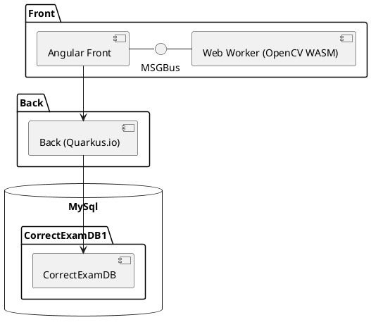
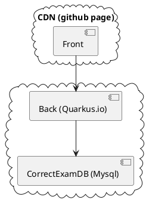

# Correct Exam

Modern software architecture in practise

  
    Press Space for next page <carbon:arrow-right class="inline"/>
  

  <button @click="$slidev.nav.openInEditor()" title="Open in Editor" class="text-xl icon-btn opacity-50 !border-none !hover:text-white">
    <carbon:edit />
  </button>
  <a href="https://olivier.barais.fr/corrigeExamFront/" target="_blank" alt="GitHub"
    class="text-xl icon-btn opacity-50 !border-none !hover:text-white">
    <carbon-logo-github />
  </a>

<!--
The last comment block of each slide will be treated as slide notes. It will be visible and editable in Presenter Mode along with the slide. [Read more in the docs](https://sli.dev/guide/syntax.html#notes)
-->

---

# My mojo

https://www.linkedin.com/pulse/i-have-right-do-research-software-engineering-hafedh-mili/

> Parnas noted "I would never have realized the nature of the problem, unless I had been working on that project, reviewing development documents, and sitting at that lunch table". Well, minimally, I need to be able to understand the conversation at that lunch table!

So here is a practical definition of what "understanding the conversation" means in this context: **You have no credibility to do software engineering research unless you have  at least the development skills/vocabulary of your graduating bachelor students.**

## That is why: I enjoy building real software, doing consultancy, working with students, ...

---
layout: center
class: text-center
---

# The project: CorrectExam

---

## Requirements

Encourage students to look at corrected copies more often to learn from their mistakes

- *Fairer* correction
  - a statistical view of results
  - anonymous, random correction...
  - ability to modify the scale on the fly

- Correct more effectively
  - simultaneously
  - question by question / copy by copy
  - batch
  - automated correction for MCQs
  - on tablet or computer
  - avoiding "all MCQs

---

# Highly inspired by GradeScope Solution

> Gradescope grading software allows students to receive faster and more detailed feedback on their work, and allows instructors to see detailed assignment and question analytics. It is an easy way to take submissions digitally in order to preserve the original work and allow for quick and easy viewing from anywhere.

<!--

This is a left-bottom aligned footer

-->

---

# Why building that piece of software ?

- Insufficient **feedback** from evaluations to students
- **ChatGPT** & consorts but also **Github Copilot**, ... are here
  - They "trivialize" a lot of our homework, exams, projects, TPs, TDs...
  - => We need to evolve the way we teach / what we teach / what we assess / how we assess it ... Paper/pencil still has a future for assessment
- Allow exams to be corrected during meetings 😀
- Save $5 per student copy
- Create an open source implementation 
  - to master privacy/teaching analytics issues
  - of real software with a complex architecture to provide a case study for :
    - explain modern software architecture to students
    - experience in software engineering research
- Trying to keep credibility (in my vision) to do software engineering research

---
layout: center
class: text-center
---

# Architectural choices / Functionality

-  Deport everything that requires computing power to the browser:
  - Image processing
  - Machine learning
  - Cache
  - Parallelization
---

# The technical architecture

- [**Quarkus**](https://quarkus.io/) for the back (Java + native compilation through GraalVM)
- [**Angular**](https://angular.io/) for the front
  - [**pdf.js**](https://mozilla.github.io/pdf.js/) to play with pdf (exam, scan exam, feedback for students)
  - [**fabric.js**](http://fabricjs.com/) to draw on top of a pdf
  - [**opencv**](https://opencv.org/) in wasm within a web worker to analyse the scan
  - [**tensorflow JS**](https://www.tensorflow.org/js) with the browser for digit and letter recognition
  - ...
- [**Docker**](https://www.docker.com/) and [K8S](https://kubernetes.io) to deploy the back and the monitoring layer
- Front is hosted in a CDN to follow the [JamStack](https://jamstack.org/) architecture (currently github page, netifly and cloudfare)
- CI/CD using [**github action**](https://github.com/features/actions), [**dockerhub webhook**](https://docs.docker.com/docker-hub/webhooks/), and [**gowebhook**](https://github.com/adnanh/webhook)
- [jest](https://jestjs.io/) and [cypress](https://www.cypress.io/) for unit and system testing

---

# Architecture overview

---

# Diagrams

### Conceptual architecture

### deployed architecture

---

# Project history

- **March 2022**: First discussion
- **April 2022**: 2 first exams in test mode @UnivRennes
- **September 2022**: new features (MCQs, translation, etc.), test extensions (IUT Toulouse, Université de Nice, INSA Rennes, etc.). 
- **Spring 2023**: Improvements based on user feedback (85 PR between January and May 2023)
- **Summer 2023**: Batch correction, performance enhancement, identity federation integration, support for standalone mode to correct directly from your PC without data sharing)
- **Autumn 2023**: Annotated pdf export, Performance improvement (Exam support for over 5000 copies) 
- **Christmas 2023**: [New scoring mechanism (hybrid)](https://github.com/correctexam/corrigeExamFront/issues/427), [hackmd](https://correctexam.github.io/hackmd.io2pdf/) and [asciidoc templates](https://correctexam.github.io/asciidoclive2pdf/), ...
- **April 2024**: New zen mode for correction, random correction, latex template evolution, improvements based on feedback from users...
- **377 + 131 PR** since the start of the project
- > **250** corrected exams (**120** users growing since September 2023) 👏👏👏👏

---

# Features 1/2

- Free-format exam template (word, libroffice, latex, asciidoc, markdown, ...) PDF input only required
- Import and manipulate scans in pdf format (page order, rotation, deletion)
- Copy sheet alignment (to correct scan defects)
- Name recognition on copies (to assign copies to students)
- Tag best/least correct answers (to generate a standard answer sheet on the fly)
- Support for direct rating, positive, negative or **hybrid**
- Quick comparison of answers with the same comments / same question
- MCQ support (not as good as AMC: Auto multiple Choice https://www.auto-multiple-choice.net/)
- Batch correction (to score a set of similar answers in a single step)
- Annotate copies with a stylus during correction
- Statistics by exam

---

# Features 2/2

- Import/Export modules with or without student data
- Import/Export comments
- Email to students with their copy in the form of an annotated pdf and/or with a link for consultation on the platform
- Export results in Excel format (to be sent to school)
- Support for University identity federations
- Zen mode
....

---

# OpenHub identity card

- [OpenHub](https://openhub.net/p/correctexam)

---
layout: center
class: text-center
---

# Feedback/Community structuring

---

# Some feedbacks

- 171 issues by twenty users
  - https://github.com/correctexam/corrigeExamFront/issues/397
> "I've just finished correcting my first exam with CorrectExam, and I'm pleasantly surprised by how easy it is to use, it's very functional, I couldn't say if I'm saving time, but the feedback to the student seems very important to me, and that's what I prefer. And I can see that features are being added as we go along (text comments with text box!)."  
Julien Geandrot, 19/11/2023
- Many emails ~300 emails
- Compliance for RGPD, Student Intellectual Property, ... (discussion with University lawyers).
- Setting up a mailing list, matrix channel, an operational committee, etc.
- GitHub as a collaboration platform

---
layout: center
class: text-center
---
# Roadmap

---

# Roadmap

- Training of pedagogical engineers at the University of Rennes ✅
- Deployment of version 1.1 on an infrastructure managed by the DSI at the Université de Rennes ✅
- Beta testing with other curious users 
- Accessibility analysis
- V1.2 A number of identified tasks ✅
  - https://github.com/correctexam/corrigeExamFront/issues?q=is%3Aopen+is%3Aissue+milestone%3AV1.2
- V1.3 ✅
  - https://github.com/correctexam/corrigeExamFront/issues?q=is%3Aopen+is%3Aissue+milestone%3AV1.3
- V1.4 ✅
  - https://github.com/correctexam/corrigeExamFront/issues?q=is%3Aopen+is%3Aissue+milestone%3AV1.3
- Publicize the project / Attract users to improve the tool
- Understand how other partners can join the adventure / Attract contributors
- V1.5
  - Support Jupyter notebook correction

---
# Where are we 

- Become usable ;)
- An ergonomist will continue to work this summer
- Nantes AND Paris are on board ;)
- Intuidoc will help
- Should be under the Esup-portal banner
- ...
---
# Perspectives

- As a research project: 
  - two DSLs to implements: 
    - MCQ scale, DMOS (Intuidoc)
  - Variability analysis

---

# Learn More

- [Documentations](https://correctexam.readthedocs.io/) 
- [GitHub](github.com/correctexam) 
- [Apps](https://correctexam.pages.dev/)
