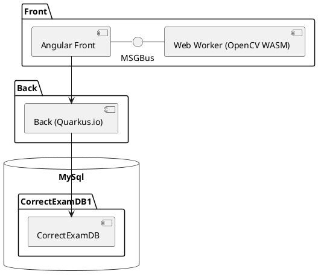
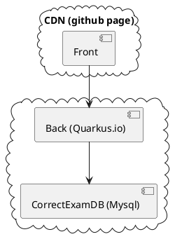

# Correct Exam

Modern software architecture in practise

  
    Press Space for next page <carbon:arrow-right class="inline"/>
  

  <button @click="$slidev.nav.openInEditor()" title="Open in Editor" class="text-xl icon-btn opacity-50 !border-none !hover:text-white">
    <carbon:edit />
  </button>
  <a href="https://olivier.barais.fr/corrigeExamFront/" target="_blank" alt="GitHub"
    class="text-xl icon-btn opacity-50 !border-none !hover:text-white">
    <carbon-logo-github />
  </a>

<!--
The last comment block of each slide will be treated as slide notes. It will be visible and editable in Presenter Mode along with the slide. [Read more in the docs](https://sli.dev/guide/syntax.html#notes)
-->

---

# My mojo

https://www.linkedin.com/pulse/i-have-right-do-research-software-engineering-hafedh-mili/

> Parnas noted "I would never have realized the nature of the problem, unless I had been working on that project, reviewing development documents, and sitting at that lunch table". Well, minimally, I need to be able to understand the conversation at that lunch table!

So here is a practical definition of what "understanding the conversation" means in this context: **You have no credibility to do software engineering research unless you have  at least the development skills/vocabulary of your graduating bachelor students.**

## That is why: I enjoy building real software, doing consultancy, working with students, ...

---
layout: center
class: text-center
---

# The project: correct exam

---

# Highly inspired by GradeScope Solution

> Gradescope grading software allows students to receive faster and more detailed feedback on their work, and allows instructors to see detailed assignment and question analytics. It is an easy way to take submissions digitally in order to preserve the original work and allow for quick and easy viewing from anywhere.

<!--

This is a left-bottom aligned footer

-->

---

# Why building that piece of software ?

- Enable to correct exams during meetings 😀
- Save $5 per student copy
- Create an open source implementation of real software with complex architecture to have a case study for
  - experiments in software engineering research
   - explaining modern software architecture to students
- Try to keep the credibility (in my vision) to do research in software engineering

---

# The technical architecture

- [**Quarkus**](https://quarkus.io/) for the back (Java + native compilation through GraalVM)
- [**Angular**](https://angular.io/) for the front
  - [**pdf.js**](https://mozilla.github.io/pdf.js/) to play with pdf (exam, scan exam, feedback for students)
  - [**fabric.js**](http://fabricjs.com/) to draw on top of a pdf
  - [**opencv**](https://opencv.org/) in wasm within a web worker to analyse the scan
  - [**tensorflow JS**](https://www.tensorflow.org/js) with the browser for digit and letter recognition
  - ...
- [**Docker**](https://www.docker.com/) and [K8S](https://kubernetes.io) to deploy the back and the monitoring layer
- Front is hosted in a CDN to follow the [JamStack](https://jamstack.org/) architecture (currently github page)
- CI/CD using [**github action**](https://github.com/features/actions), [**dockerhub webhook**](https://docs.docker.com/docker-hub/webhooks/), and [**gowebhook**](https://github.com/adnanh/webhook)
- Pluggable architecture based on micro-services to integrate question type automatic correction (let developper use their own programming language to provides solutions that automatically correct some questions)

---

# Architecture overview

---

# Diagrams

### Conceptual architecture

### deployed architecture

---

## Business model

---

## JHipster to generate the application skeleton

> JHipster is a development platform to quickly generate, develop, & deploy modern web applications & microservice architectures.

- jhipster 7.7.0 for the front
- jhisper 6.10.15

> Manual alignement of the API evolution 😀 (@Djamel)

---

# Demo and code overview

- [demo](https://correctexam.github.io/)
- [repo back](https://github.com/correctexam/corrigeExamBack)
- [repo front](https://github.com/correctexam/corrigeExamFront)

---
layout: center
class: text-center
---

# Learn More

[Documentations](https://sli.dev) · [GitHub](https://github.com/slidevjs/slidev) · [Showcases](https://sli.dev/showcases.html)
